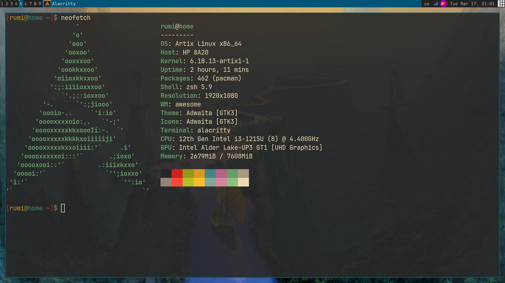

files for my artix linux system. install by running `run` as root. Requires a nice system with sane defaults,
including (but not limited to):

- `base-devel`
- `linux`
- `sof-firmware` (optional, if you're having audio issues use this)
- `gcc`
- `coreutils`

### post-install

#### `passwd`
... to set a password. Also make sure to provide your username as the first argument

##### example

```bash
passwd billy
```

#### `startx`

...  to start an awesome desktop (:D)

#### `hsetroot`

... to set a wallpaper. Provide the image as well as a output mode (e.g `hsetroot -cover hentai.jpg`)

##### example

```bash
hsetroot -cover hentai.jpg
```
